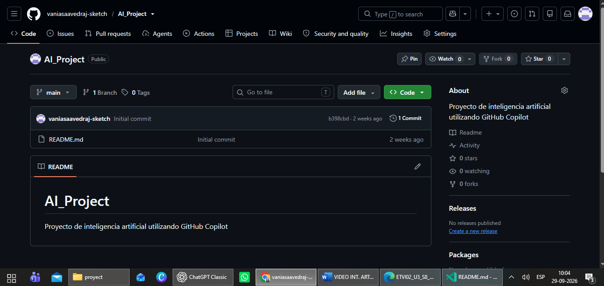
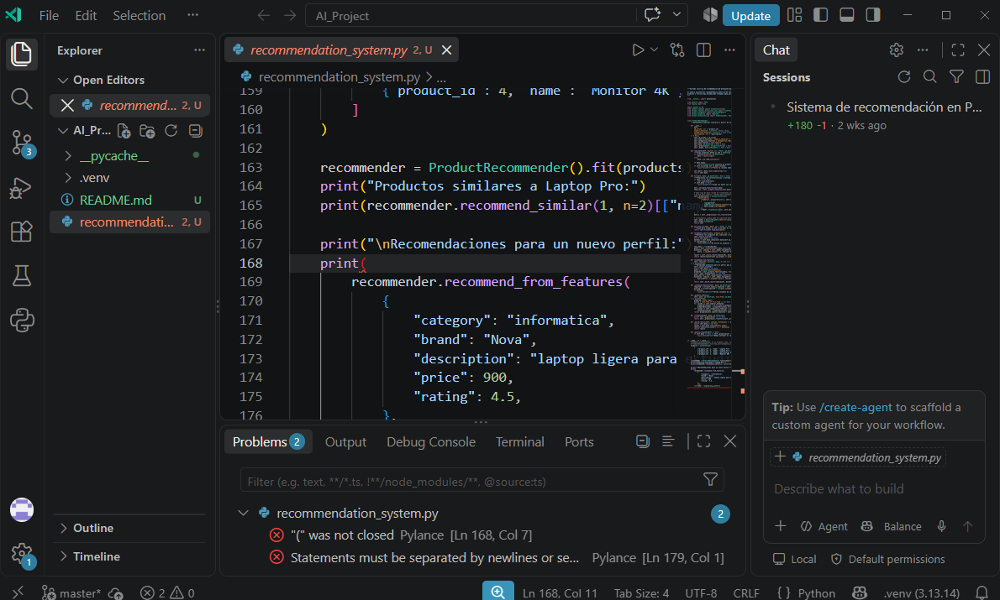
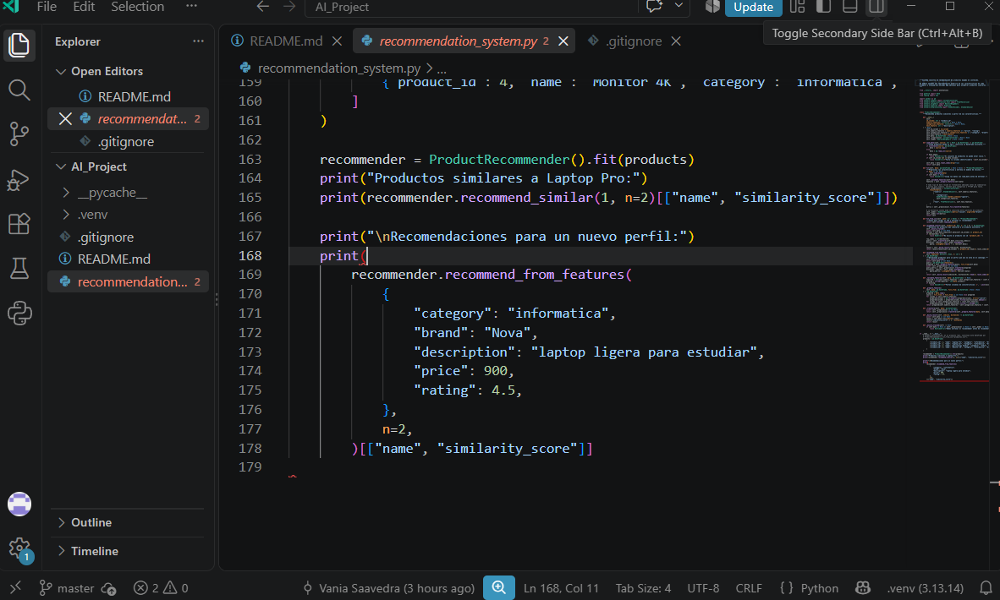
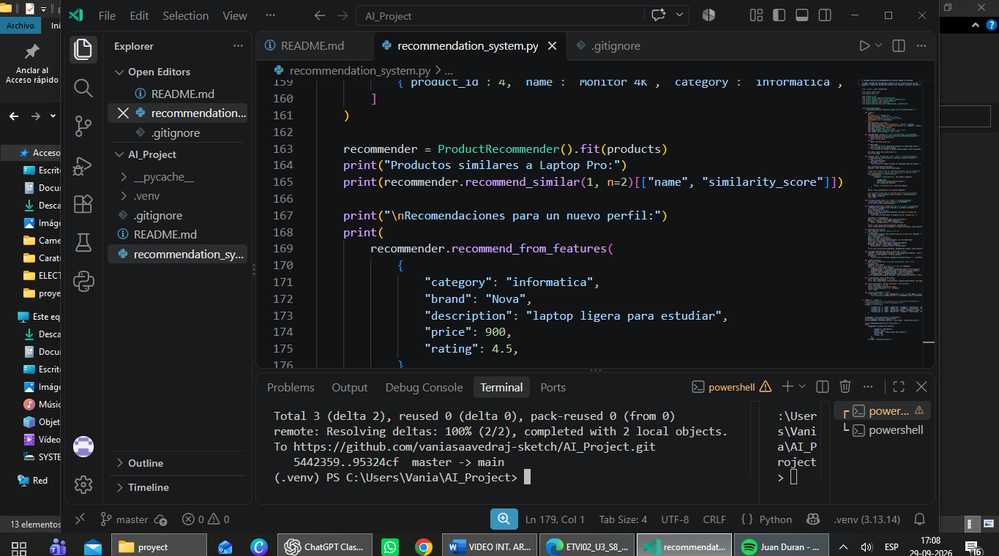
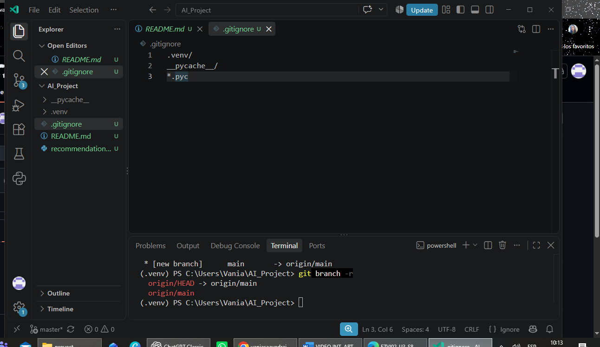
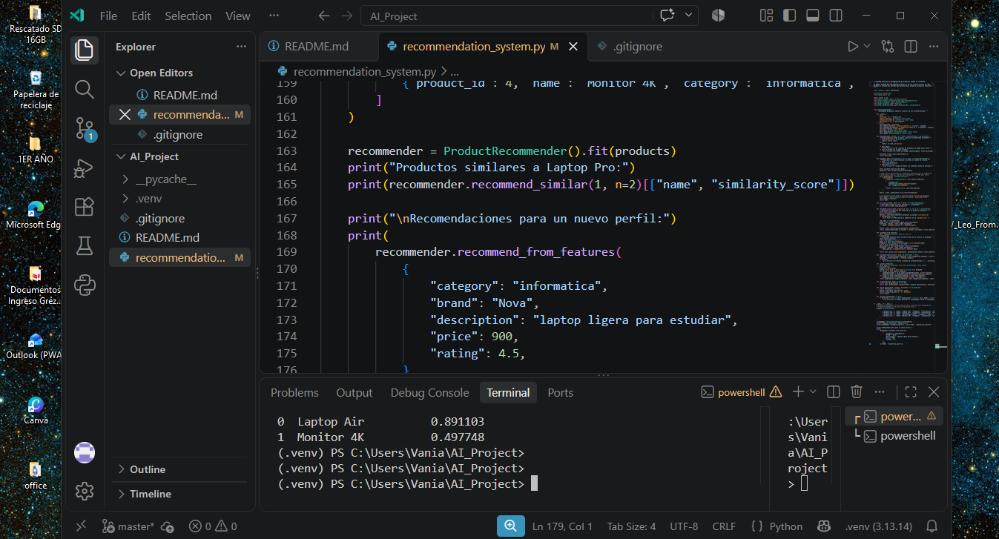
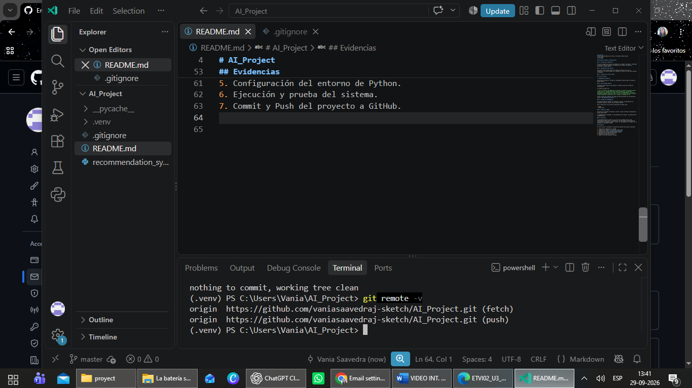

# AI_Project
Proyecto de inteligencia artificial utilizando GitHub Copilo

## Actividad formativa: GitHub Copilot

### 1. Creación del repositorio

Se creó un repositorio público en GitHub con el nombre `AI_Project`, destinado al desarrollo de un sistema de recomendación utilizando inteligencia artificial y GitHub Copilot.

### 2. Configuración del entorno

Se utilizó Visual Studio Code para trabajar de manera local con el repositorio. Se instaló Python y se configuró un entorno virtual para ejecutar el proyecto.

### 3. Creación del archivo Python

Se creó el archivo:

`recommendation_system.py`

Este archivo contiene el sistema de recomendación desarrollado con apoyo de GitHub Copilot.

### 4. Uso de GitHub Copilot

Se utilizó GitHub Copilot para generar el código inicial del sistema de recomendación.

El prompt utilizado fue:

> Crea un sistema de recomendación de productos en Python utilizando pandas y scikit-learn. El sistema debe cargar datos de productos, seleccionar características relevantes, entrenar un modelo de recomendación y permitir recomendar productos similares a partir de las características de un producto. Incluye comentarios explicativos en el código y un ejemplo de uso.

Copilot generó una propuesta de código que posteriormente fue incorporada al archivo `recommendation_system.py`.

### 5. Sistema de recomendación

El programa permite trabajar con productos y generar recomendaciones de productos similares a partir de sus características.

Para el desarrollo se utilizaron bibliotecas de Python como:

- pandas
- scikit-learn
###Ejemplo de productos utilizados###  
Como ejemplo de funcionamiento del sistema de recomendación, se pueden considerar los siguientes productos:

- Laptop — Tecnología
- Audífonos — Tecnología
- Polera — Ropa
- Zapatillas — Ropa
- Libro — Educación

Estos productos permiten representar distintas categorías y comprobar cómo el sistema puede generar recomendaciones de acuerdo con las características o preferencias del usuario.
### 6. Prueba del código

Se ejecutó el programa utilizando el entorno virtual de Python configurado en Visual Studio Code.

La prueba permitió comprobar el funcionamiento del sistema y la generación de recomendaciones.

### 7. Conclusión

La actividad permitió conocer el uso práctico de GitHub Copilot como herramienta de apoyo para la programación. Se pudo generar código mediante instrucciones en lenguaje natural, revisar su funcionamiento y trabajar con un repositorio conectado a GitHub.

## Evidencias

### 1. Creación del repositorio

Se creó el repositorio `AI_Project` en GitHub para desarrollar el proyecto de inteligencia artificial.

### 2. Clonación del repositorio en Visual Studio Code

Se clonó el repositorio desde GitHub y se abrió localmente en Visual Studio Code.

### 3. Creación del archivo Python

Se creó el archivo `recommendation_system.py`, destinado al desarrollo del sistema de recomendación.

### 4. Generación del código mediante GitHub Copilot

Se utilizó GitHub Copilot para generar el código inicial del sistema de recomendación mediante instrucciones en lenguaje natural.

### 5. Configuración del entorno de Python

Se configuró el entorno virtual de Python necesario para ejecutar el proyecto.

### 6. Ejecución y prueba del sistema

Se ejecutó el programa desde Visual Studio Code para comprobar el funcionamiento del sistema y la generación de recomendaciones.

### 7. Commit y Push del proyecto

Finalmente, se realizaron las operaciones de Commit y Push para subir los cambios al repositorio remoto de GitHub.

